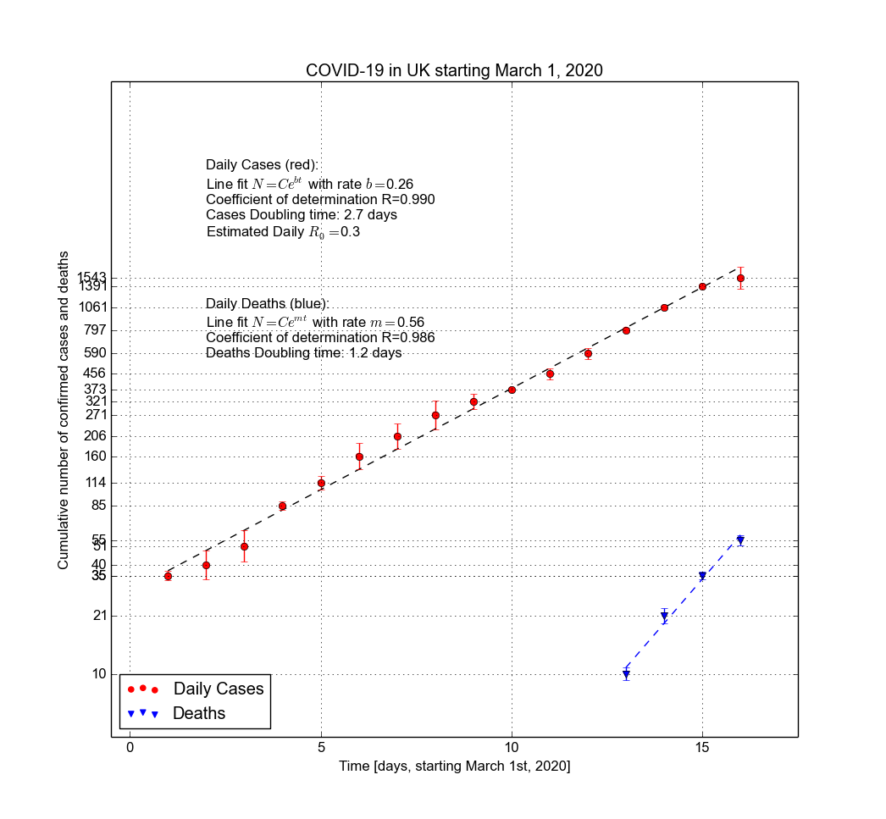
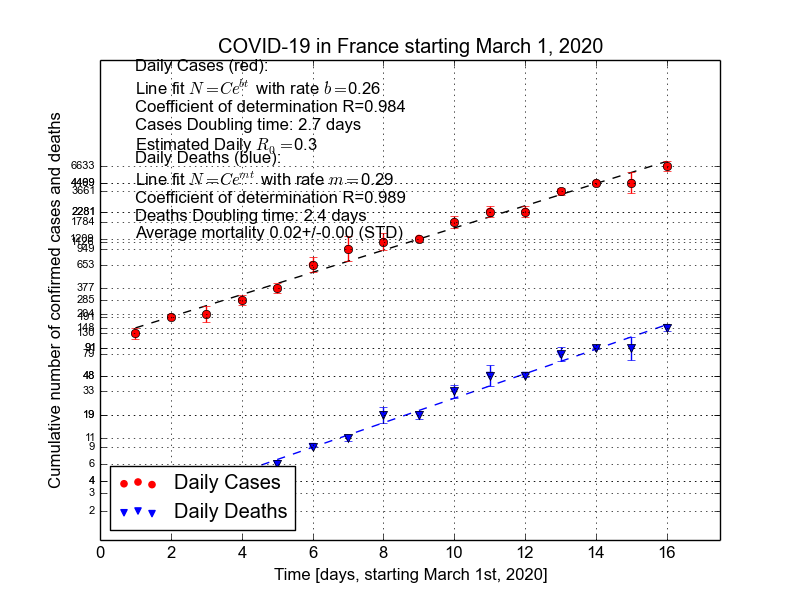
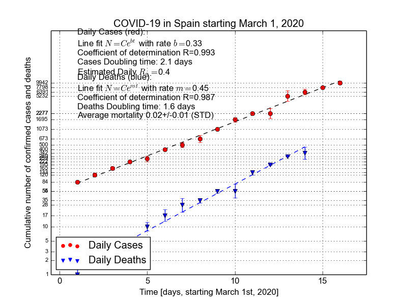
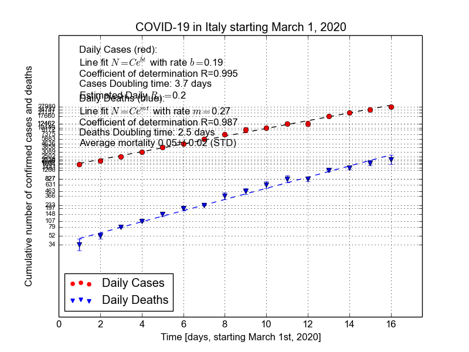
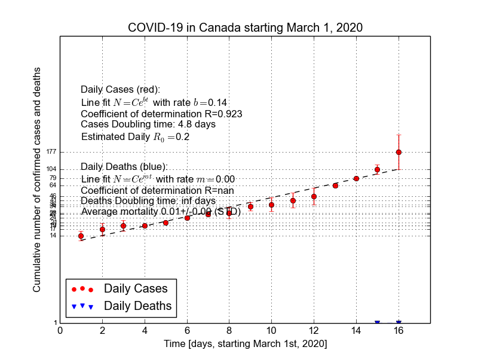
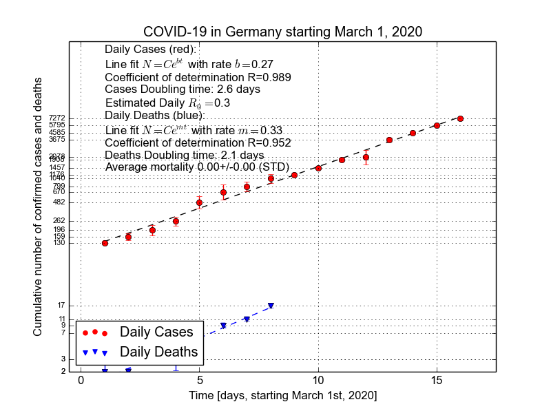
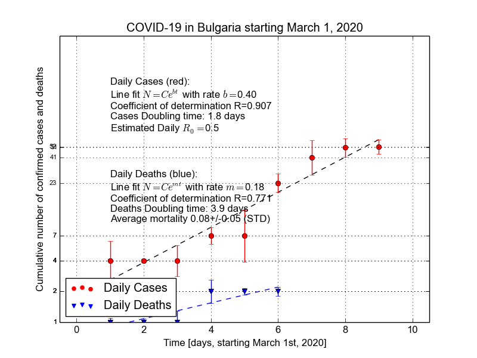

Results
=======

Current results for linear fit of daily number of cases and daily number of
deaths per country

Parameters:

- `b`: exponential rate at which daily cases rise (in units `day-1`);
- `m`: exponential rate at which daily deaths rise (in units `day-1`);
- Coefficient of determination: how good the linear fit is: perfect fit R=1;
- Cases/Deaths doubling time: the number of days in which the cases/deaths will double;
- Estimated R0: the number of people a single infected person will infect per day, on average;
- Average Mortality Rate: average percent of number of cases that die.

Simple script that plots the evolution of COVID-19
==================================================

This is a simple and easily adaptible script that plots the
log number of daily cases of COVID-19 and deaths vs time. It does the
following automated tasks:

- downloads the data (if prompted) for the required countries;
- extracts the daily number of cases and daily deaths from the original datasets;
- plots log(number of cases) and log(number of deaths) vs time;
- fits a line through and computes the line parameters and least
  squares errors;
- computes the coefficient of determination (how good the linear fit is);
- computes the estimated infected population doubling time and death toll doubling time;
- computes the daily basic reproductive number (how many new infections
  result daily from one infected individual); note that the actual `R0`
  (basic reproductive number) can be estimated by multiplying by 7 (days, the median
  duration of the infectious phase).

Usage
=====

Requirements:

- `python2.7` or higher (ok with `python3.x`);
- Package `xlrd` available from PyPi via `pip install xlrd`;

Command line use:

`python cov_lin_models.py --countries France,Spain,Italy,Canada,US --download-data True --month 3`

where `--countries` is a list of countries to study ;
`download-data`: `True` for downloading the data to the `country_data`
directory or `False` to use an older copy from the said directory;
`--month`: numeral of the month to plot.

UK Data
=======

Official data source: https://www.gov.uk/government/publications/covid-19-track-coronavirus-cases

Worldwide Data
==============
Johns Hopkins gitHub repository: https://raw.githubusercontent.com/CSSEGISandData/COVID-19/master/csse_covid_19_data/csse_covid_19_daily_reports
