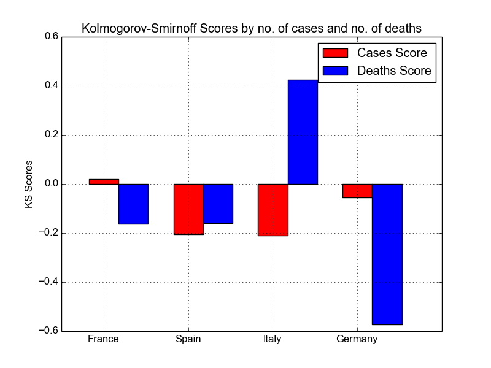

COVID-19: Exponential Phase
===========================
Table of Contents
-----------------
* [Introduction](#Introduction)
* [UK](#uk)
* [Quarantines](#quarantines)
* [Europe](#europe)
* [US-Canada](#us-canada)
* [Parameters](#Parameters)
* [Script](#Script)
* [APPENDIX](#APPENDIX)

# Introduction

Current results for linear fit for logarithmic data of daily number of cases and daily number of
deaths per country. Almost every country is undergoing an expoenential infection spread phase,
`exp(bt)`, characterised by the increase rate `b` (units: 1/day or day-1) and time coordinate `t` (units: day);
in most cases, the exponential rates `b` are 0.25-0.3 day-1 in the first phase, subsequently decreasing
to values of 0.1-0.2 day-1 after a 7-10 days (except recent phases of Scandinavian countries that show
a significantly lower rate due to reduction in number of tests), yieling reported cases doubling times of
2-3 days, intially, subsequently these doubling times increasing to 3-4 days.

We also simulate the number of actual cases by shifting the deaths curve by 20 days in the past and multiplying
with a set of possible mortality rates: 0.5%, 1%, 2%, 3% and 4%, then extrapolating the number of cases to
present day via a forecasted rate of deaths over the next 20 days equal to half the current deaths rate.

Results for March are included in [this table](https://github.com/valeriupredoi/COVID-19_LINEAR/blob/master/ALL_COUNTRIES_DATA_31-03-2020.csv)
The simulated number of cases give a rough proportion of the total country population that has been in fected so far,
an example is given below for a group of countries; these results are in good agreement with the Imperial College
London [report](https://www.imperial.ac.uk/media/imperial-college/medicine/sph/ide/gida-fellowships/Imperial-College-COVID19-Europe-estimates-and-NPI-impact-30-03-2020.pdf) for a mortality rate of 1%.

Country  |  % pop infected at m=0.5% | % pop infected at m=1% | % pop infected at m=2%
:-------:|:-------------------------:|:----------------------:|:----------------------:
Austria | 4% | 2% | 1%
United Kingdom | 3% | 1.5% | 0.75%
Spain | 32% | 16% | 8%
Italy | 10% | 5% | 2.5%
Germany | 2% | 1% | 0.5%
France | 6.4%  | 3.2% | 1.6%
Sweden | 5% | 2.5% | 1.3%
United States | 2% | 1% | 0.5%

# UK

## Current reported situation and projections

Spread in the UK: measured cases and deaths  |  10-day projections
:-------------------------------------------:|:-------------------------:
     | 

Left panel: daily cumulative numbers of reported cases and deaths (updated daily); right panel: same numbers
only with two best- and worst-case projections over the next 10 days (March 20-March 30); worst-case
projection uses the measured growth rates for reported cases and deaths as of March 21 and spins up the exponential models
over 10 days; best-case projection does the same, only using quarantine-like rates. Prediction: number of deaths
on March 30: between 1700-9000. Given that on March 21, about 2000 out of the reported 5000 cases were in
London, the estimate is 40% of the deaths in 10 days time will be in London, meaning anywhere in between 600 and 3600.

## Using a Kolmogorov-Smirnoff test

We can use a Kolmogorov-Smirnoff test (KS) to compare cases and deaths distributions
between the UK and similar-sized countries in Europe:

cases: KS statistic  |  cases: KS p-value
:-------------------:|:------------------:
France: 0.25 | France: 0.30
Spain: 0.36 | Spain: 0.04
Italy: 0.57 | Italy: 0.00
Germany: 0.32 | Germany: 0.09

deaths: KS statistic  |  deaths: KS p-value
:-------------------:|:------------------:
France: 0.26 | France: 0.44
Spain: 0.35 | Spain: 0.15
Italy: 0.58 | Italy: 0.00
Germany: 0.39 | Germany: 0.10

The KS statistic needs to be small and the p-value high for similarity between distributions,
so `p-value - KS` is a good metric for evaluation:

From the figure above we notice that only France shows significant similarity with UK's reported
cases and deaths distributions.

## Simulating the actual cases

Simulating the actual number of infected individuals based on the number of recorded deaths and the
exponential evolution of this number: numbers of deaths evolve exponentially with the rate `m` and we
can use a set of possible mortality fractions `M` (M is defined as the number of deaths / number of
actual cases at the time of the infection, assume average desease span of 20 days: from moment of infection
to moment of death). we compute the simulated number of actual cases deaths x 1/M and shift in time by 20 days,
then extrapolate via the exponential evolution of deaths to the current date.

Spread in the UK: measured cases and deaths  |  Simulated actual cases
:-------------------------------------------:|:-------------------------:
 |  

Linear fit of the exponential spread in the United Kingdom, starting March 1st, 2020.
Data is piped automatically from the official database provided by the
[UK Government](https://www.gov.uk/government/publications/covid-19-track-coronavirus-cases).
Left plot (Spread in the UK: measured cases and deaths) the measured and reported number of cases
and deaths are plotted, together with their model fits. Right plot: we simulate the actual cumulative
number of cases based on the reported number of deaths multiplied by 1/mortality rate `Mr`; mortality rate
values are 0.005, 0.01, 0.02, 0.03 and 0.04.

# Quarantines

TLDR: Italy has achieved a reduction in the spread rate: numbers from there suggest
that measures taken may reduce the number of cases by 20%, converseley, for a daily
increase in cases of 10,000 and an average death rate of 2%, that means saving 200
lives per day.

Daily-updated comparison between linear fits to exponential spreads in the UK and Denmark.
The UK is displaying an almost-perfect exponential spread at a rate of 0.25 day-1 giving a
doubling time of the infected population of 2.7 days; the same numbers have been brought down
by Denmark to 0.06 day-1 and 12.5 days.

Denmark experiences a sharp decrease in the virus spread after 13 March, 2020, reducing the
spread rate from a (noisy) 0.49 day-1 to a stable 0.06 day-1; in terms of infected population
growth this means it will double almost every two weeks - the same population doubling time
is less than 3 days currently in the UK (18 March, 2020) -- **THIS is an example of reducing
the numbers of tests and it is not a consequence of social distancing measures, this is why
such results need to be placed in the context of actual country-specific situations.**

Spread in the UK                             |  Spread in Denmark
:-------------------------------------------:|:-------------------------:
 |  

There a few examples already that show that the combination of better testing and restricted
social interactions contribute to bringing down the acceleration of the spread: the figure shows
the start of two different outbreaks - Italy and UK, shifted in time since Italy's outbreak started
earlier in February: at the start the two outbreaks differ in spread rate (and cases doubling time)
but comparing the two rates is not relevant due to different biases (more or less testing, different
population densities etc). What matters is that Italy, within the past month,
has introduced a set of strict control measures
and these measures are now visible in the spread rate: a decrease of 40% in the spread rate.
The UK is only now (time of writing: 18 March, 2020) starting to introduce such measures and the effect is left to be seen.
Just how important such a decrease of the spread rate is? Current numbers in Italy are ~32,000; at
its initial rate that would mean in a week this number rises to ~310,000 resulting in 10,000 more deaths;
a constant rate of 0.19 will result in a total of 120,000 cases in a week, with a total of 2,000 more
deaths, factor five less.

Infection starts (UK and Italy)                           |  Current evolution in Italy
:--------------------------------------------------------:|:-----------------------------:
 |  

Figure above (left): comparison of infection starts (shifted in time to overlap)
for Italy (February, ending March 1st) and UK (March); Italy shows a faster infectious spread at a
rate of 0.32 day-1 as compared to the UK's 0.23 day-1; Figure above (right): current
situation in Italy: social distancing measures reduce the the spread rate t0 0.18 day-1, with an
actually even slower emergent trend in the last days.

A reduction in exponential rate from 0.3 day-1 to 0.15 day-1 due to active measures
translates, for an infection that produces 10,000 new cases in one day, to a reduction
of 20% new cases the next day and that means, on average,
that 200 people will not die 10-14 days later.

Probably the most evident case of a (rather strong) quarantine can be seen in China in the figure below:
the Chinese government has instituted it on January 23 and effects can be seen as early as January 27.

Figure above: confirmed cases for China a few days before and after 23 January quarantine.
About 5 days after the quarantine institution we notice
a slower infectious spread at a rate of 0.23 day-1,
as compared to the initial 0.41 day-1.

(date written: 19 March, 2020)

- the numbers to trust more are the number of deaths and the rate at which they grow, since the reported cases are biased wrt actual number of cases due to different types of testing and the actual number of tests performed per day; in terms of the number of deaths: we are seeing a very high number (today: 144 deaths, 3300 confirmed cases) and a very high measured rate: 0.43 per day (only Spain has a similar rate, accumulated over a longer period, so more trustworthy as a number). To put this into perspective: countries like France, on the day they recorded such a high death number, their total number of reported cases was twice as ours, and knowing they both were doing about half the daily tests we are doing (France has been doing ~2500 [1](http://www.rfi.fr/en/france/20200318-france-step-up-coronavirus-new-test-methods-death-toll-climbs-covid-19-priority-risk-elderly-symptoms) tests per day, the UK has been doing ~5000 tests per day [2](https://ourworldindata.org/covid-testing?fbclid=IwAR0ZIMyVyWLCfn5uYwW10A1T1GdoZrFymt3L5OAqz2REWoGiT2w508gP2-A)) that means numbers don't add up to explain such a high death toll the UK is seeing. My take is that our testing system is very biased (this is just a supposition since I don't know much about it) but is done in such a way that, even if we test twice as much as France does at the moment, we are still finding half the cases they are finding (on average), see the [plot](https://github.com/valeriupredoi/COVID-19_LINEAR/blob/master/country_plots/COVID-19_LIN_France.png)
- if testing is biased, we can explain the number of deaths by saying the number of cases in the UK is much higher than what it is reported; using the comparison with France again, that would mean we are in an equivalent position (they report a total ~10000 cases as of today); an average death rate of 0.01-0.02 is something we have measured so far quite accurately vs the reported cases so that would mean today in the UK 7500-15000 cases should have been reported;
- that puts us in a very bad position because the epidemic is much more advanced than what we declare at the moment, and we are actually not at all behind neither France nor Spain (Spain is suffering from very bad testing too); if we instate strong measures now, the effect will have been felt only much later ie in a full infectious phase time 10-14 days from now, and even then I can not tell how how strong the effect is; my estimate is we will stay in exponential phase for a long time, but similar to Italy the rate will gradually decrease; a rate of 0.25 would mean in a week from now we will have reported ~19,000 cases but if the testing is not fixed that would be a France reported equivalent of ~60,000 cases out of which 20% in hospital-condition =12,000 needing hospitalization; two weeks from now, provided that the rate will have decreased to 0.2 due to the imposed measures the total number of realistic cases would be 240,000 meaning about 40,000 needing hospitalization, and even if the patients from previous week have had recovered completely that would mean we need 30,000 beds.

# Europe

Even though most of the countries display an exponential spread,
some of the (smaller) countries (Belgium, Netherlands) are starting to
display a slow-down in the rate of daily cases (**WARNING**: this
could well be because of a drop in number of tests or testing procedures!).
Look for the green lines, representing the new, slow-down increase.

## France

## Belgium

## Spain

## Italy

## Romania

## Portugal

## Germany

## Austria

## Netherlands

## Switzerland

## Bulgaria

## Ireland

## Slovakia

## Poland

## Israel

It is very intriguing to see that all Scandinavian countries show a significant
decrease in the spread rate after (roughly) March 14, 2020.

## Denmark

## Finland

## Sweden

## Norway

# US-Canada

## US

## Canada

## Kentucky

## Tennessee

## Orgeon

# Parameters

- `b`: exponential rate at which daily cases rise (in units `day-1`);
- `m`: exponential rate at which daily deaths rise (in units `day-1`);
- Coefficient of determination: how good the linear fit is: perfect fit R=1;
- Cases/Deaths doubling time: the number of days in which the cases/deaths will double;
- Estimated R0: the number of people a single infected person will infect per day, on average;
- Average Mortality Rate: average percent of number of cases that die.

# Script

This is a simple and easily adaptible script that plots the
log number of daily cases of COVID-19 and deaths vs time. It does the
following automated tasks:

- downloads the data (if prompted) for the required countries;
- extracts the daily number of cases and daily deaths from the original datasets;
- plots log(number of cases) and log(number of deaths) vs time;
- fits a line through and computes the line parameters and least
  squares errors;
- computes the coefficient of determination (how good the linear fit is);
- computes the estimated infected population doubling time and death toll doubling time;
- computes the daily basic reproductive number (how many new infections
  result daily from one infected individual); note that the actual `R0`
  (basic reproductive number) can be estimated by multiplying by 7 (days, the median
  duration of the infectious phase).

Requirements:

- `python2.7` or higher (ok with `python3.x`);
- Package `xlrd` available from PyPi via `pip install xlrd`;
- Package `scipy`: for an easy installation I recommend using `miniconda/anaconda`;
  for a `pip` installation on an older architecture and `python2.7` you will have
  to install the `lapack` and `blas` libraries, a Fortran compiler and `python-dev`:
  - `sudo apt-get install python-dev`
  - `sudo apt-get install gfortran`
  - `sudo apt-get install libblas3 liblapack3 liblapack-dev libblas-dev`
  - `sudo pip install scipy==0.16`

Command line use:

`python cov_lin_models.py --countries COUNTRIES --regions REGIONS --month 3`

where `--countries` is a list of countries to study
or `file: COUNTRIES` (just add your country there);
`--regions` is a list of countries to study
or `file: REGIONS` (just add your region or US state there)
`download-data`: `True` (default) for downloading the
data to the `country_data` directory or `False` to use
an older copy from the said directory;
`--month`: numeral of the month to plot.

# APPENDIX

UK Data:

Official data source: https://www.gov.uk/government/publications/covid-19-track-coronavirus-cases

Worldwide Data:

Johns Hopkins University CSSE gitHub repository: https://github.com/CSSEGISandData/COVID-19/tree/master/csse_covid_19_data/csse_covid_19_daily_reports
Alternative JHU cleaned up data: https://raw.githubusercontent.com/jbarton311/coronavirus-analysis/master/coronavirus/output_data/HOPKINS_CLEANED.csv

Italy Data:

https://github.com/pcm-dpc/COVID-19/blob/master/dati-andamento-nazionale/dpc-covid19-ita-andamento-nazionale.csv
